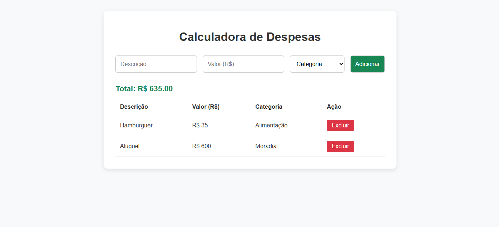

# 💰 Controle de Despesas Pessoais

Este é um projeto simples de **controle de despesas** desenvolvido com **HTML, CSS e JavaScript puro**, utilizando **localStorage** para salvar os dados no navegador.

## 📌 Funcionalidades

- ✅ Adição de uma nova despesa (descrição, valor e categoria)
- ✅ Listagem das despesas em uma tabela
- ✅ Cálculo automático do total de despesas
- ✅ Remoção individual de despesas (com atualização do total)
- ✅ Salvamento e carregamento automático de dados usando localStorage
- ✅ Limpeza automática do formulário após o envio

## 🧠 Conceitos aplicados

- Manipulação do DOM com JavaScript
- Eventos (`submit`, `click`)
- Uso de funções construtoras
- LocalStorage para persistência dos dados
- Funções para modularização do código
- Conversão de dados com `JSON.parse` e `JSON.stringify`

## 🖼️ Layout

O layout é simples e funcional, com uma tabela que exibe:

- Descrição da despesa
- Valor (formatado)
- Categoria
- Botão para excluir a despesa

## ▶️ Como usar

1. Clone este repositório ou copie os arquivos HTML, CSS e JS.
2. Abra o arquivo `index.html` no navegador.
3. Preencha o formulário com os dados da despesa.
4. Clique em "Cadastrar" para adicionar a despesa.
5. Use o botão "Excluir" para remover uma despesa da lista.
6. O valor total será automaticamente atualizado.

## 🗃️ Tecnologias utilizadas

- HTML5
- CSS3
- JavaScript (ES6+)
- localStorage
- 
## Imagem do projeto

